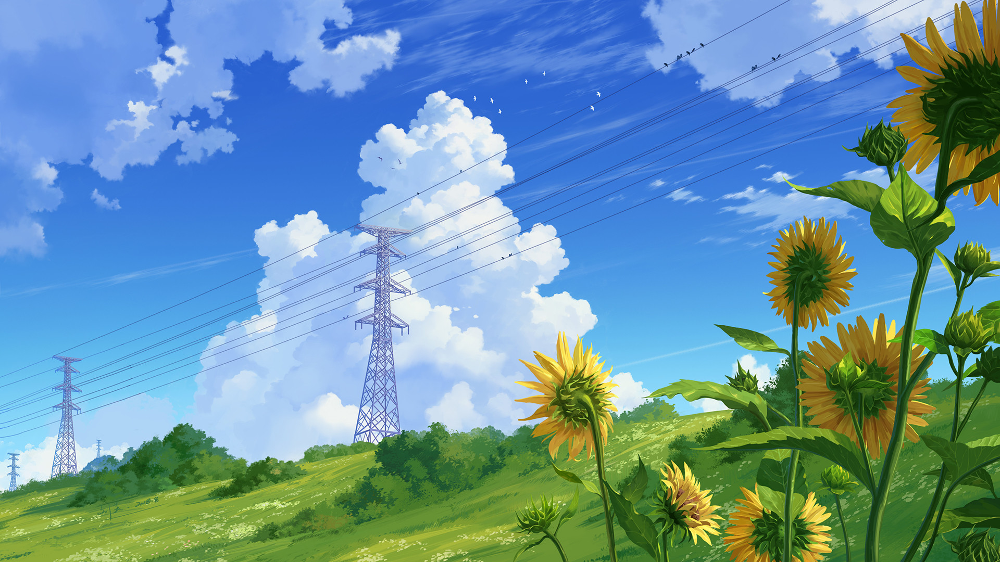
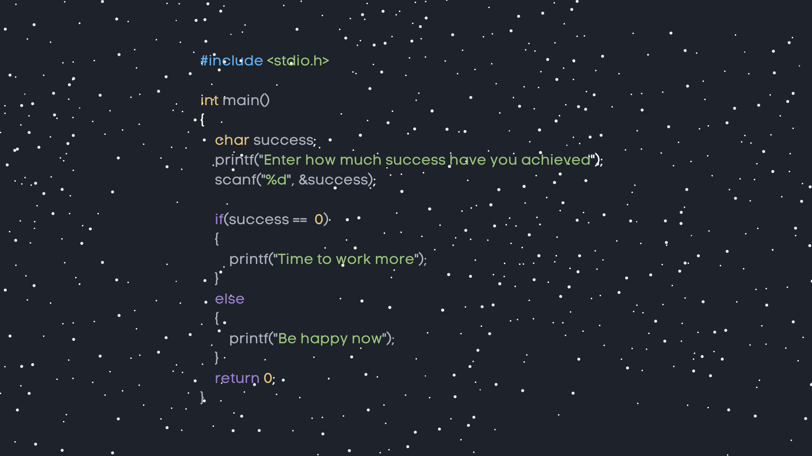

title: 2021年终总结
date: 2022-09-23 00:51:08
tags: 工作感悟 生活
categories:
- 工作感悟
cover: '../img/1.png'
feature: true
---

> 2021年对于我来说是平凡又跌宕起伏的一年，有快乐有不甘，有进步有懈怠。下面就工作，技术成长，生活和对未来的期望做一个总结吧!希望在2022年会有不一样的惊喜。也希望自己立下的flag能够一一兑现. 
> 加油🐱‍💻🎈🎈🎈

# 工作

对工作，对未来有诸多想象和期待。希望自己能够大展拳脚。古人曰："夫英雄者，胸怀大志，腹有良谋，有包藏宇宙之机，吞吐天地之志者也"我虽没有多么大的志向，但求今天的的自己比昨天有进步，明天比今天有进步。 
好了，不废话了。先反思一下今年两次找工作的经历吧。我前前后后总共面试了十多家公司吧，拿到了6个offer，两次跳槽经历。 第一次跳槽是从之前的公司辞职后的。。 思量再三，还是想换个环境。 辞职之后首先是制作简历然后就在boss直聘上开始疯狂投简历，就开始了面试之旅。基本上是按照一天3个面试的样子。然后在拿到第三个offer以后就开始选择哪个offer的性价比高一些。最后选择了一家还不错的。待遇对于之前还算不错的。 在这家公司待了3个月临近转正的时候，我提出了辞职。具体理由先不讲（卖个关子，以后专门写一篇面试找工作的文章详述）。 到了10月份。我又重新制作简历，开始了 海投。这次比上次要快很多。同样也是拿到了3个offer，也没有上次面试奔波的那么累，都是通过线上面试的。最终入职了现在这家公司。 总体来说，工作上还是比较顺利的，尽管有一些小波折，尽管找工作的过程有些累，但是回过头来看，所有的一切都是值得的！

# 技术
前端技术进一步得到锻炼，基本上都是提前完成客户提出的功能需求。能够按照客户的要求去实现UI，页面交互，数据渲染。react技术也提高了，能够自主封装组件和函数，代码风格更加规范了. 学到了socket,http封装,UDP/TCP等后端的一些技术等等,也学习了一些node后端的知识.还有研究了JS的一些原理性的知识,JS的代码执行机制,异步任务和同步任务,异步执行队列,深拷贝,浅拷贝,防抖节流等等.总之学到的新知识还不算很多,但是是在实际项目中用到的.理解的还是比较深刻. 前端这一块儿,后面肯定会继续学习下去,追求前端前沿技术潮流.但是后面可能会主攻Golang后端方向了.因为对自己 的职业生涯规划,还是希望能够做后端,能够更加深入,走得更远,站在巨人的肩膀上触摸到更高的天花板吧. 

# 生活
生活方面,我本人在工作之余没什么事情,到处游玩,然后就是喜欢逛各种博客论坛和社区.后面自己也想通过写博客这种方式来锻炼自己的写作能力,并且督促自己不断学习新的技术.先立个flag:2022年开始,每周产出一篇高质量的博客.然后看情况.每月出一期视频.培养自己的自律意识吧. 

# 未来
对于未来,虽然心里是有目标,但是不知道为啥还是会有迷茫感.或近期,或远期. 2022年,希望会是稳定前进的一年,希望自己的技术能够更加精进.在前端技术领域,我想自己做一个个人的博客项目.前后端全部由自己一个人独立完成.再就是把还没有学习的vue3的知识体系也全部学完,做一个完整的项目.因为选择工作中都是用的react技术栈,所以vue技术栈都忘记的差不多了,技术这个东西,你不用就会很快忘记.所以需要不断的回顾复习才能记得牢固.再就是希望自己能够坚持这些好的习惯.

# 给自己立下的flag

- [x] 个人博客项目
- [x] vue3技术栈学习
- [x] Golang后端技术栈的学习
- [ ] 每周一篇高质量博客,每月一期视频
- [ ] 做自己的自媒体账号.把微信公众号,B站,抖音,知乎账号等都运营起来

希望明年2023年的自己再看这篇博客能够骄傲的说我完成了,问心无愧了!加油就🐱‍🚀🐱‍🏍😎
